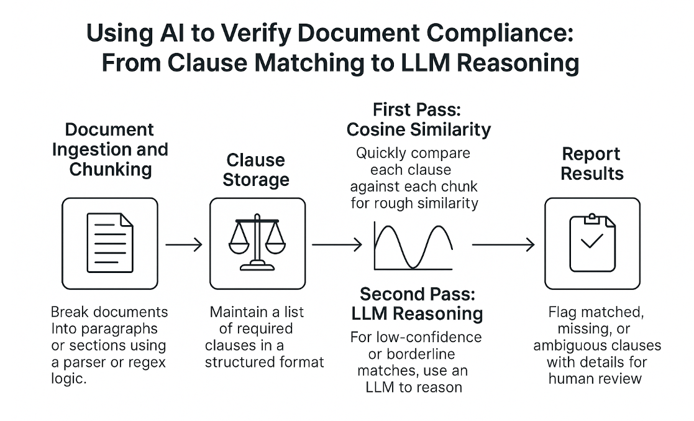

# Using AI to Verify Document Compliance

Whether it’s a vendor agreement that must include an arbitration clause, or a loan document requiring specific disclosures, ensuring the presence of these critical clauses is vital. Traditionally, this kind of document review is slow, manual, and subject to human error.

With artificial intelligence, we can automate much of this analysis. From classical algorithms like cosine similarity to advanced reasoning using large language models (LLMs), AI offers powerful tools to compare documents and validate their contents. In this post, I’ll show how to use both techniques to verify whether required clauses are present in a document.

## Common Use Cases

- **Contract Compliance**: Ensure third-party contracts include mandatory terms such as confidentiality, arbitration, or indemnity clauses.
- **Financial Document Review**: Confirm that loan packages include borrower rights, rate disclosures, or risk warnings.
- **Regulatory Checks**: Verify that required language appears in filings for legal or tax compliance.

## Two Approaches to Clause Verification

### 1. Algorithmic Matching Using Cosine Similarity

Cosine similarity is a statistical method that compares two text segments based on the angle between their vector representations. It’s especially useful when comparing short text segments for semantic similarity.

**Example:**
```python
from sklearn.feature_extraction.text import TfidfVectorizer
from sklearn.metrics.pairwise import cosine_similarity

required_clause = "This agreement shall be governed by the laws of the State of New York."
document_text = [
    "This contract is subject to New York State law.",
    "The parties agree to resolve disputes through arbitration.",
]

vectorizer = TfidfVectorizer().fit([required_clause] + document_text)
vectors = vectorizer.transform([required_clause] + document_text)

scores = cosine_similarity(vectors[0:1], vectors[1:]).flatten()
for i, score in enumerate(scores):
    print(f"Chunk {i}: Similarity Score = {score:.2f}")
```
### 2. Using LLMs for Clause Reasoning

LLMs like GPT-4 can go beyond exact matches and interpret whether a clause is present "in spirit," even if phrased differently.

**Example Prompt for LLM:**
> *"You are reviewing a contract. Does the following text contain a clause that states the agreement is governed by the laws of New York? If so, provide the text and rate your confidence on a scale of 1 to 5."*

This method can handle:
- Paraphrased language
- Reordered clauses
- Embedded clauses within unrelated sections

## A Combined Workflow



1. **Document Ingestion and Chunking**  
   Break documents into paragraphs or sections using a parser or regex logic.

2. **Clause Storage**  
   Maintain a list of required clauses in a structured format (e.g., JSON, database).

3. **First Pass: Cosine Similarity**  
   Quickly compare each clause against each chunk for rough similarity.

4. **Second Pass: LLM Reasoning**  
   For low-confidence or borderline matches, use an LLM to reason about the presence and adequacy of the clause.

5. **Report Results**  
   Flag matched, missing, or ambiguous clauses with details for human review.

## Considerations

- **Scalability**: Cosine similarity is fast and ideal for batch processing. LLMs are slower but smarter.
- **Accuracy**: Combine both for best results—use cosine to filter and LLMs to reason.
- **Privacy**: Ensure sensitive documents are handled securely, especially when using external APIs.
- **Evaluation**: Track precision, recall, and false positives. Tune your similarity thresholds and prompts accordingly.

Clause verification is one of the most practical applications of AI in legal and financial domains. By blending statistical and generative approaches, you can create systems that are both fast and reliable. As models continue to improve, hybrid techniques like these will become foundational to how we manage document compliance at scale.

